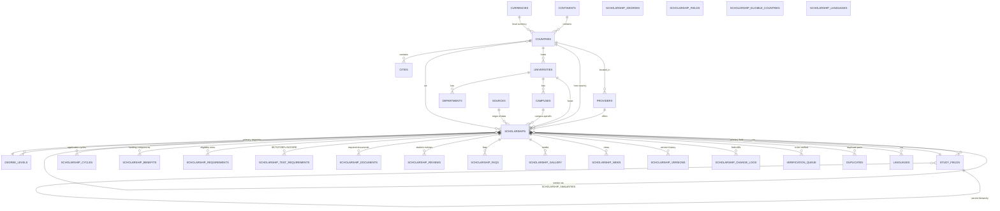
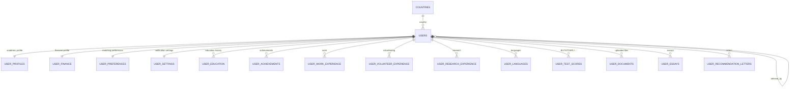
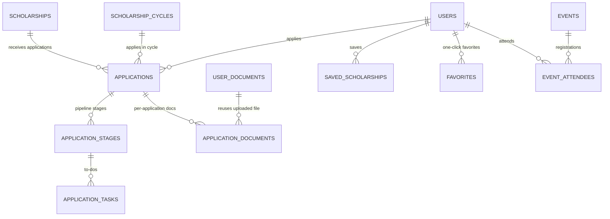
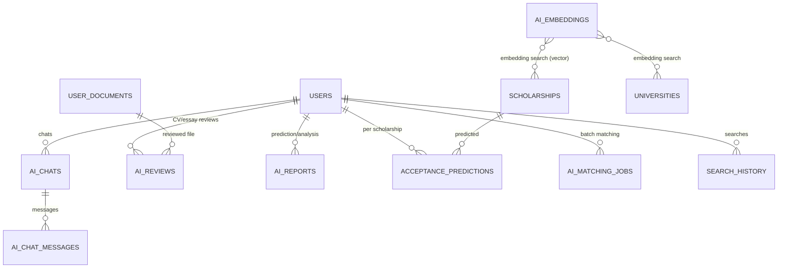
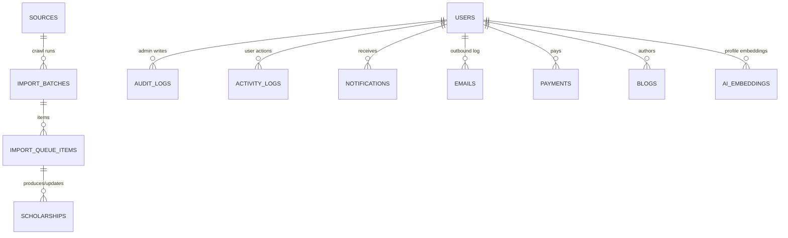

# SmartScholar — ERD

Entity-relationship overview. Full column definitions live in
[DATABASE.md](./DATABASE.md) — this file shows relationships at entity level.
`1—N` one-to-many, `N—M` many-to-many (via join table), `1—1` one-to-one.

## Core entities

## Users & their data

## Applications & engagement

## AI subsystem

## Import pipeline & ops

## Relationship inventory (76 tables)

| # | Table | Direct FKs (count) |
|---|---|---|
| 1 | continents | 0 |
| 2 | countries | continents(1), currencies(1) |
| 3 | cities | countries(1) |
| 4 | currencies | 0 |
| 5 | languages | 0 |
| 6 | universities | countries, cities, users(verified_by) |
| 7 | campuses | universities, countries, cities |
| 8 | providers | countries |
| 9 | departments | universities |
| 10 | degree_levels | 0 |
| 11 | study_fields | study_fields(self) |
| 12 | scholarships | providers, countries, universities, campuses, degree_levels, study_fields, currencies(application_fee), users(verified_by), sources |
| 13 | scholarship_cycles | scholarships |
| 14 | scholarship_benefits | scholarships, currencies |
| 15 | scholarship_requirements | scholarships |
| 16 | scholarship_test_requirements | scholarships |
| 17 | scholarship_documents | scholarships |
| 18 | scholarship_degrees | scholarships, degree_levels |
| 19 | scholarship_fields | scholarships, study_fields |
| 20 | scholarship_eligible_countries | scholarships, countries |
| 21 | scholarship_languages | scholarships, languages |
| 22 | scholarship_similarities | scholarships, scholarships |
| 23 | scholarship_reviews | scholarships, users |
| 24 | scholarship_faqs | scholarships |
| 25 | scholarship_gallery | scholarships |
| 26 | scholarship_news | scholarships |
| 27 | blogs | users |
| 28 | events | countries, cities, universities |
| 29 | event_attendees | events, users |
| 30 | users | countries, cities, languages, users(referred_by) |
| 31 | user_profiles | users, countries(×2), degree_levels(×2), study_fields, universities, currencies |
| 32 | user_education | users, degree_levels, study_fields, countries, cities |
| 33 | user_achievements | users |
| 34 | user_work_experience | users, countries, cities |
| 35 | user_volunteer_experience | users, countries |
| 36 | user_research_experience | users, study_fields |
| 37 | user_languages | users, languages |
| 38 | user_test_scores | users |
| 39 | user_finance | users, currencies |
| 40 | user_preferences | users |
| 41 | user_settings | users |
| 42 | user_documents | users, user_documents(parent) |
| 43 | user_recommendation_letters | users |
| 44 | user_essays | users |
| 45 | applications | users, scholarships, scholarship_cycles |
| 46 | application_stages | applications |
| 47 | application_tasks | applications, application_stages |
| 48 | application_documents | applications, application_stages, user_documents, scholarship_documents |
| 49 | saved_scholarships | users, scholarships |
| 50 | favorites | users, scholarships |
| 51 | ai_chats | users |
| 52 | ai_chat_messages | ai_chats |
| 53 | ai_reviews | users, user_documents, application_documents |
| 54 | ai_reports | users |
| 55 | acceptance_predictions | users, scholarships |
| 56 | ai_embeddings | 0 (polymorphic entity_type/entity_id) |
| 57 | ai_matching_jobs | users |
| 58 | search_history | users, scholarships(clicked) |
| 59 | notifications | users |
| 60 | emails | users |
| 61 | payments | users, currencies, users(reviewed_by) |
| 62 | sources | countries, providers |
| 63 | import_batches | sources, users(created_by) |
| 64 | import_queue_items | import_batches, scholarships |
| 65 | scholarship_versions | scholarships, users(created_by) |
| 66 | scholarship_change_logs | scholarships, users(changed_by) |
| 67 | duplicates | scholarships(×2), users(resolved_by) |
| 68 | verification_queue | scholarships, users(reviewer_id) |
| 69 | audit_logs | users |
| 70 | activity_logs | users |
| 71 | analytics_events | users |
| 72 | daily_metrics | 0 |
| 73 | cron_runs | 0 |
| 74 | app_settings | users(updated_by) |

## Normalization notes

- 3NF: join tables (`scholarship_degrees`, `scholarship_fields`,
  `scholarship_eligible_countries`, `scholarship_languages`) eliminate
  multi-valued columns; `currencies` eliminates repeating money attributes.
- Polymorphism is deliberate and constrained: `ai_embeddings` and
  `audit_logs`/`activity_logs` use `entity_type` text validated by CHECK against
  a fixed list — a shared, column-typed `entity_id uuid`.
- `scholarships.search_vector` is a generated column (functional dependency on
  `title`/`description`) — derived data, not a normalization violation.
